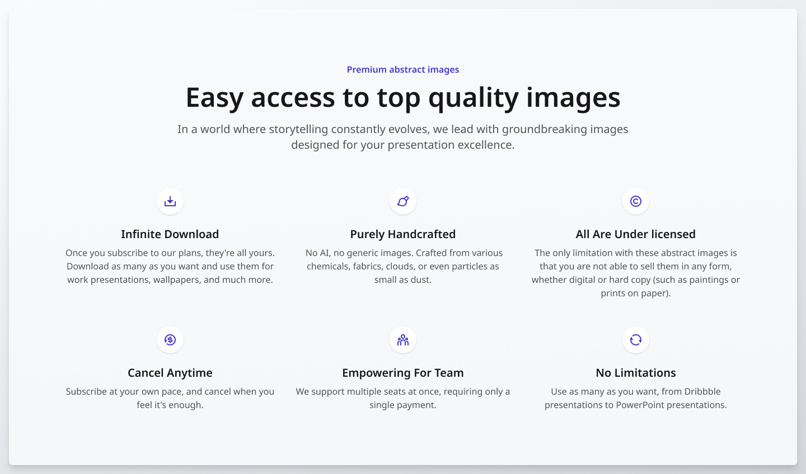

# Features Section Grid

A responsive 3-column features section built using **HTML** and **CSS**. This project replicates a design specification across desktop, tablet, and mobile breakpoints. Each feature includes an icon, title, and description in a clean and accessible layout.

## 📋 Project Brief

Build a responsive features section based on the provided desktop, tablet, and mobile designs.

### 🧩 Requirements

- **Design Fidelity**: Match provided designs (fonts, spacing, colors, etc.)
- **Responsive Behavior**:
  - Font sizes adjust based on screen size
  - Layout stacks vertically on small screens, columns on larger screens
- **Cross-Browser Compatibility**: Works in Chrome, Firefox, and Safari

### 🎯 Stretch Goals

- **Performance Optimization**: Efficient CSS/JS for fast load times
- **Accessibility**:
  - Semantic HTML
  - ARIA roles where necessary
  - Alt text on images/icons

## 🛠️ Tech Stack

- HTML5
- CSS3
- JavaScript

## 💡 Features

- ✅ Responsive grid layout
- ✅ Scales typography and spacing
- ✅ Semantic and accessible markup
- ✅ Performance and cross-browser tested

## 📸 Screenshots

## 🙌 Acknowledgments

This project was built as part of a challenge on the [GreatFrontEnd Projects](https://www.greatfrontend.com/projects) platform.

Want to build and grow alongside other developers?  
Join the [GreatFrontEnd Discord server](https://www.greatfrontend.com/community) to connect with a welcoming community ranging from new developers to senior engineers from top tech companies.

